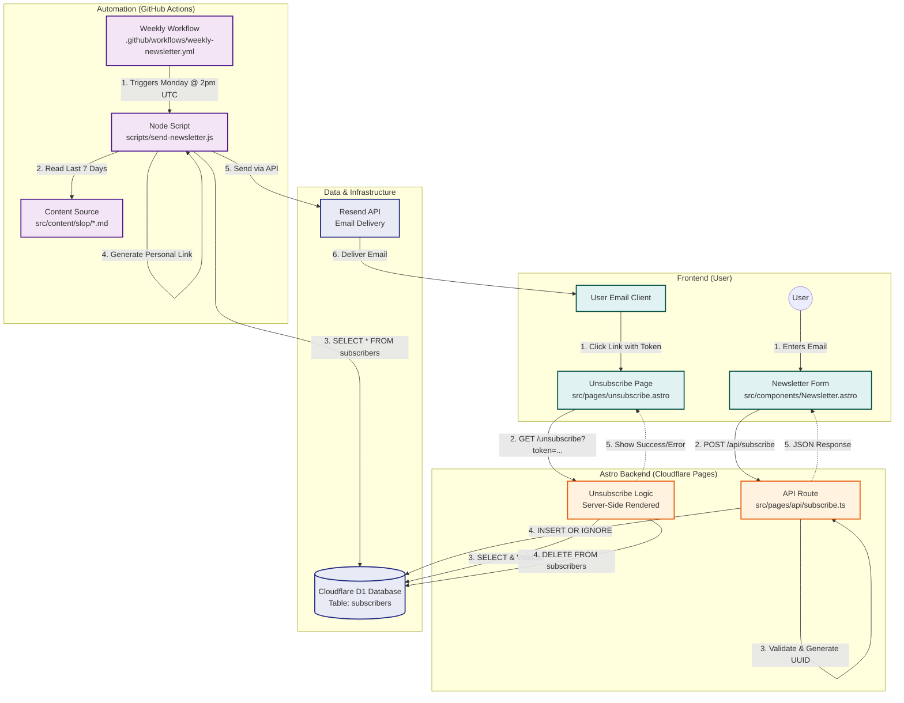

# Newsletter Architecture

This document outlines the architecture of the self-hosted newsletter system for `kiranic.com`, powered by Cloudflare D1, Resend, and GitHub Actions.

## System Overview

The system consists of three main workflows:
1.  **Subscription**: Users sign up via the website.
2.  **Automation**: A weekly script fetches content and emails subscribers.
3.  **Unsubscribe**: Users remove themselves via secure tokens.

## Detailed Component Breakdown

### 1. Subscription (`src/pages/api/subscribe.ts`)
- **Method**: `POST`
- **Logic**: 
  - Validates email format.
  - Generates a unique UUID `token` for the subscriber.
  - Inserts into D1: `INSERT OR IGNORE INTO subscribers (email, token) VALUES (?, ?)`.
  - Returns JSON success/error to the frontend form.

### 2. Automation (`scripts/send-newsletter.js`)
- **Trigger**: GitHub Actions Cron (`0 14 * * 1` - Mondays at 2 PM UTC).
- **Process**:
  - Fetches markdown files from `src/content/slop` modified in the last 7 days.
  - Fetches all subscribers from D1 via Cloudflare API.
  - Iterates through subscribers:
    - Generates a personalized unsubscribe link: `https://kiranic.com/unsubscribe?token=[USER_TOKEN]`.
    - Renders the HTML email template.
    - Sends via Resend API to `kp@news.kiranic.com`.

### 3. Unsubscription (`src/pages/unsubscribe.astro`)
- **Method**: `GET` (SSR)
- **Logic**:
  - Extracts `token` from URL query parameters.
  - access D1 Database via `Astro.locals.runtime.env.DB`.
  - Verifies token existence.
  - Executes `DELETE FROM subscribers WHERE token = ?`.
  - Renders a success or error message to the user.
